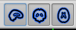

**By the end of this practical you should be able to:**  
* [ ] use the terminal to navigate to where your MRI data for this course will be  
* [ ] open MR images with fsleyes  
* [ ] distinguish between a structural and functional image and explain key differences in how they were measured  
* [ ]  use fsleyes to identify what coordinates at the cursor location mean, adjust contrast of the image, and toggle images on/off  
 

**Access FastX** through the remote login:  
https://fastx.divms.uiowa.edu:3443/   
 

**First prep step**, make a folder for holding data for our labs:  
*  Open your terminal by clicking on the icon showing a little black screen
*  Type `pwd`. Where are you in the computer filesystem?
*  Type `ls`. What other files are here? 
*  To make a new folder using the terminal type `mkdir fmriLab`
  *  Did it work? Type `ls` 
  *  How did that work? Type `man mkdir`
*  Go into the new folder you made by typing `cd fmriLab`
 

**Second prep step**, download some images:  
*  Copy/paste `wget -O lab01_images.tar.gz https://osf.io/bprq5/download/`
*  Use commands introduced above to see what was downloaded
*  To unpack the download copy/paste `tar -xvf lab01_images.tar.gz`
*  Move yourself into the folder with data by typing `cd osfshare`
 

**Open fsleyes**:  
*  Open fsleyes by typing `fsleyes &`
  *  The `&` at the end tells the terminal to run this program in the background, meanwhile you still have access to the terminal to run other commands
 

**Open an image with fsleyes**:  
*  Click on `File` -> `Add from file`
*  Open the file named `sub-97-T1w_defaced.nii.gz`
  * Tips on decoding the filename
 

**Understanding the T1 image**:  
* Initial observations: try to answer these questions with your neighbours
  * How many dimensions are there in the image?
  * What kinds of tissues are the brightest and darkest?
  * Place your cursor on example spots and try to find their coordinates
  * Brief primer on anatomy
 

**Terms for talking about anatomy in an image**:  
*  Hover over these icons and click them on/off to see what they do  

*  What do the letters on the four sides of each view shown below mean?  

 

**Adjust contrast:**  
*  Find this tool in your GUI   
*  What happens when you set the max to 2000?  What does this tell you about what the numbers mean?
*  Now what do you think will happen when you set the max to 50?
*  Try and let's discuss..
*  Reset with the RESET button
 

**Add a functional image on top of the structural**:  
*  Use steps learned from above to add a new image
*  Add the file named `sub-97_task-flanker_bold.nii.gz`
*  Place cursor in the brain somewhere and then toggle on/off the functional image using this button: 

* Observations
  * How many dimensions are there in the image?
  * What kinds of tissues are the brightest and darkest?
  * Place your cursor on example spots and try to find their coordinates
  * Adjust contrast like you did above, similar or different than T1?