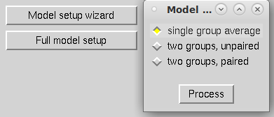
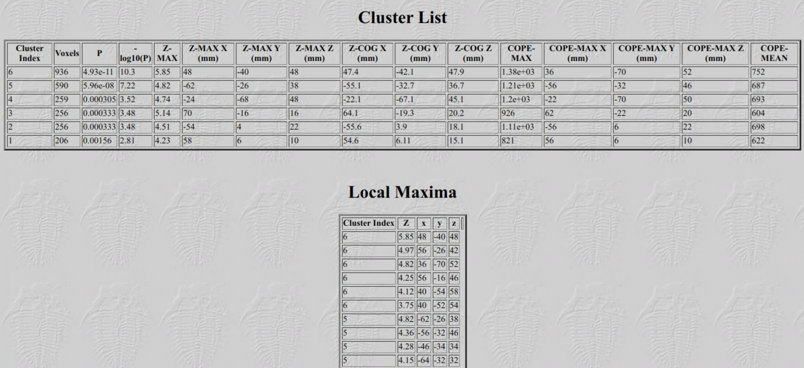

**By the end of this practical you should be able to:**  
* [ ] use the FEAT GUI to create a group-level map of task-related BOLD activation  
* [ ] locate and understand results using the html reports  
 

**Access FastX** through the remote login:  
https://fastx.divms.uiowa.edu:3443/   
 

**Prerequisite**: Before you start group analysis, you should have `flanker.feat` output folders that you created in the derivatives folder for sub-001 and sub-002. I have provided the output for sub-097, who also performed this same task. Your directory tree should look like this:  

 

**Group analysis GUI**: Our group analysis will determine the average activation across subjects for each of our contrasts that we made within-subjects (e.g., con>baseline, neu>baseline, inc>baseline, inc>nue, inc>con).
*  In terminal, move yourself to the derivatives folder by typing `cd ~/fmriLab/data/bids/derivatives/`
*  Type `fsl` and click on `FEAT FMRI analysis`
*  In the top-left menu, select `Higher-level analysis`:  

 

**Set input and output on `Data` tab**: 
*  Keep default of `Inputs are lower-level FEAT directories`
*  Keep `Number of inputs` to 3, because we have 3 subjects 
*  Click to `Select FEAT directories` and select each of your `flanker.feat` folders:  

*  Keep `Use lower-level copes` as default, these are the five contrasts we set for the single-subject analyses
*  Specify output directory to be in derivatives with the name `group_n3`:  

 

**Setup group model on `Stats` tab**:  
*  Select `Fixed effects`, which computes an average generalizable to only this set of participants. This is most appropriate if you have less than 10 subjects.
*  Select `Model setup wizard` and keep the default of `single-group average` and click `Process`:  
 
 

**Our group model**: Now what does the red line represent? 

 

**Post-stats tab**: all settings here can stay as default.
 

**Click `Go`**: 
*  An html output report will come up in your browser. 
*  Once done, navigate to `Results` and click on `Lower-level contrast 3 (inc)`
*  You should see the map below:  

 

*  Click on the image in the html report, let's talk about the table you see below:  
