**By the end of this practical you should be able to:**  
* [ ] use the FEAT GUI to create a group-level map of task-related BOLD activation  
* [ ] locate and understand results using the html reports and fsleyes  
 

**Access FastX** through the remote login:  
https://fastx.divms.uiowa.edu:3443/   
 

**Prerequisite**: Before you start group analysis, you should have `feat.feat` output folders that you created in the derivatives/func folders for sub-01, sub-02, and sub-03.  
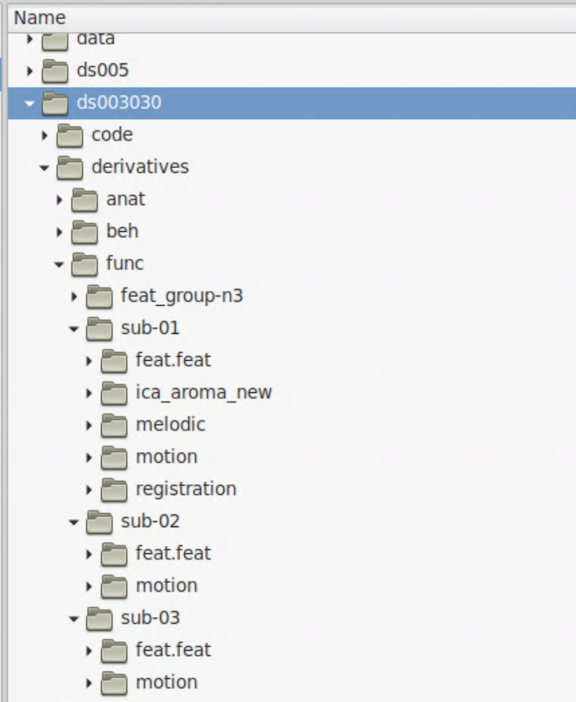
 

**Group analysis GUI**: Our group analysis will determine the average activation across subjects for each of our contrasts that we made within-subjects (e.g., checker>music, music>checker).
*  In the terminal, move yourself to the derivatives folder by typing `cd ~/fmriLab/ds003030/derivatives/func`
*  Type `fsl` and click on `FEAT FMRI analysis`
*  In the top-left menu, select `Higher-level analysis`:  
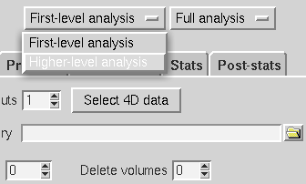
 

**Set input and output on `Data` tab**:  
*  Keep default of `Inputs are lower-level FEAT directories`
*  Keep `Number of inputs` to 3, because we have 3 subjects 
*  Click to `Select FEAT directories` and select each of your `feat.feat` folders:  
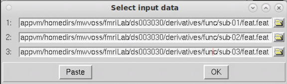

*  Keep `Use lower-level copes` as default, these are the five contrasts we set for the single-subject analyses
*  Specify output directory to be in derivatives with the name `feat_group-n3_fixed`:  
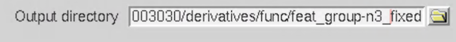
 

**Setup group model on `Stats` tab**:  
*  Select `Fixed effects`, which computes an average generalizable to only this set of participants. This is most appropriate if you have less than 10 subjects of pilot data.
*  Select `Model setup wizard` and keep the default of `single-group average` and click `Process`:  
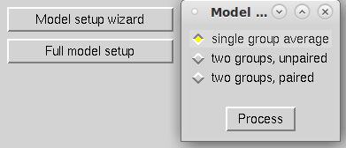 
 

**Our group model**: Now what does the red line represent? 
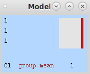
 

**Post-stats tab**: this is where we set our thresholds for statistical significance
* Thresholding options given within FEAT:
    * **Uncorrected**: this creates a voxel-level threshold _without_ correcting for multiple comparisons (don't do it)
    * **Voxel**: corrects for multiple comparisons in a bonferroni style, but with smoothness of the image accounted for (not common)
    * **Cluster**: thresholding is applied to the Z-statistics at the level specified and then remaining contiguous clusters are evaluated on the probability a cluster that large would be seen if there was no effect (well-accepted threshold: Z>3.1, p<.05, based on [Eklund et al., 2016](https://github.com/mwvoss/MRI-lab-classes/blob/master/PSY6280-2020-FA2020/pdfs/Eklund-2016-Cluster%20failure_%20Why%20fMRI%20inferenc.pdf)). 
    * Note more options are available in the command-line [cluster](https://fsl.fmrib.ox.ac.uk/fsl/fslwiki/Cluster) program
    * FSL also offers thresholding of 3D statistical maps based on False Discovery Rate (FDR) with their command-line [fdr](https://fsl.fmrib.ox.ac.uk/fsl/fslwiki/FDR) program

 

**Click `Go`**: 
*  An html output report will come up in your browser. 
*  Once done, navigate to `Results` and click on `Lower-level contrast 1 (checker>music)`
*  You should see the map below:  
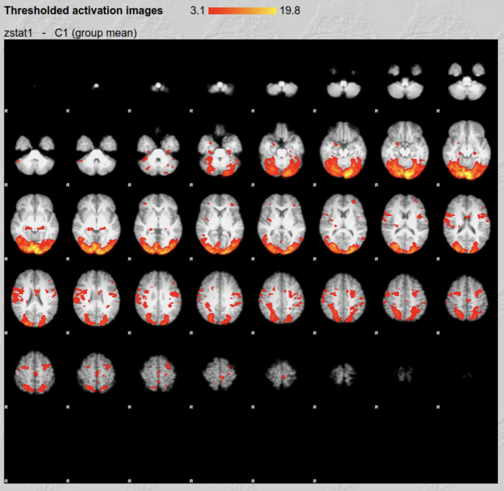
 

*  Click on the image in the html report, let's talk about the table you see below:  
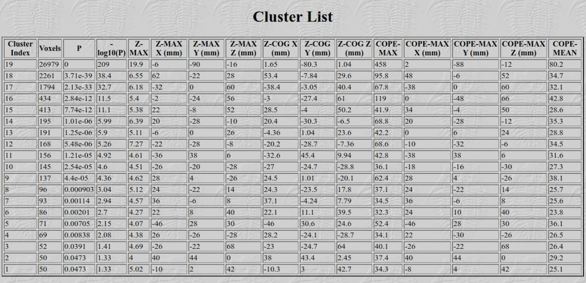

* Just like with single-subject analyses, we can also use `fsleyes` to view the results more interactively:
    * Use the html report to locate the directory where the activation maps are on your computer
    * Use the terminal to move yourself there: `cd /fmriLab/ds003030/derivatives/func/feat_group-n3_fixed/cope1.feat`
    * Open `fsleyes` through the terminal with settings for viewing FEAT output: `fsleyes -ad /opt/fsl/data/standard/MNI152_T1_2mm_brain.nii.gz thresh_zstat1.nii.gz`
    * You should see a display like below in `fsleyes`. Clicking on the buttons with arrows in the column labeled `Z Max location` will move your cursor to the location of that peak in brain activation. 
 
 

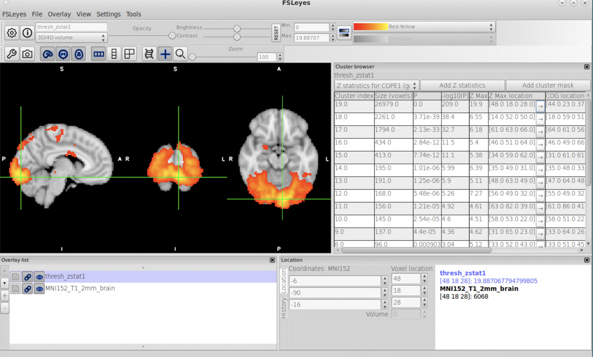

 

At the end of a task-activation group analysis our statistical maps are in a standard template space, which is a coordinate system and anatomical space that is common for all subjects so that we can compare activations across the subjects, to results from other studies using the same common reference space, and to anatomical atlases built in that same reference space.
* FSL comes with a [collection of atlases](https://fsl.fmrib.ox.ac.uk/fsl/fslwiki/Atlases) in the MNI152 standard template space that we can view in `fsleyes` to look up anatomy of activation peaks.
* In the `fsleyes` menu, select `Settings -> Ortho View 1 -> Atlas panel` as shown below. You will now see a new panel in your `fsleyes` layout that links you to the atlases bundled with FSL. 
 
 

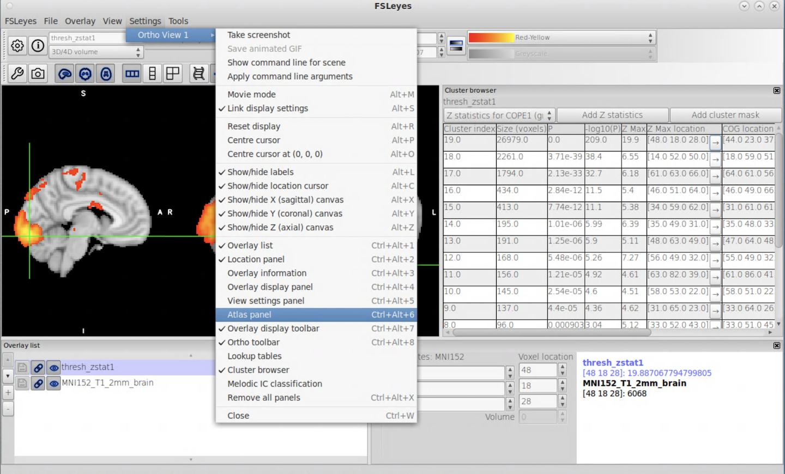
 

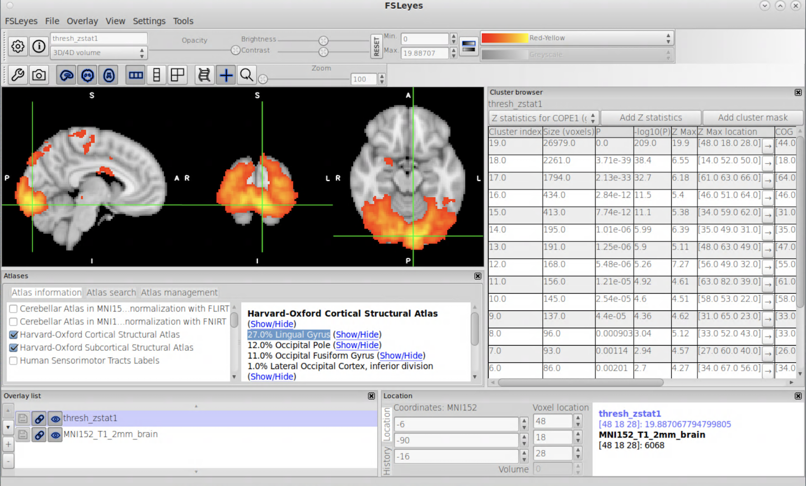

 

You can create figures of your results for posters, talks, papers, grants, using these fsleyes tools: 
* View -> Lightbox View 
    * Adjust slice spacing and plane
    * Click the _wrench_ icon in the top left to access advanced control settings, which gives you the option to turn on a colorbar
    * Adjust the minimum Z statistic shown on the map in fsleyes to match your statistical threshold, so that the colorbar minimum reflects your statistical thresholding
    * Use the camera icon to take a screenshot, or any other tool you prefer for screenshots.

 

**How would we report these results in a paper?**   
* The Organization for Human Brain Mapping formed a  Committee on Best Practices in Data Analysis and Sharing (COBIDAS), who published best practices for reporting fMRI/MRI results in their [COBIDAS report](http://www.humanbrainmapping.org/files/2016/COBIDASreport.pdf).
    * Section 6.3 on _Mass Univariate Modelling_ describes best practices for reporting results from these analyses in posters and papers
    * Sharing the full statistical parametric maps, both thresholded and unthresholded, is highly encouraged. The repository [NeuroVault](https://neurovault.org/) is well-accepted, and you can also share on Open Science Framework and/or github with other shared study materials.
* Links to several examples:
    * [Voss et al., Neurobiology of Aging (Table 1)](https://github.com/mwvoss/MRI-lab-classes/blob/master/PSY6280-2020-FA2020/pdfs/Voss-2018-Striking%20a%20chord%20with%20healthy%20aging_.pdf)
    * [Ritchey et al., Neuropsychologia, (Table 2)](https://github.com/mwvoss/MRI-lab-classes/blob/master/PSY6280-2020-FA2020/pdfs/Ritchey-2019-Dissociable%20medial%20temporal%20pathw.pdf)