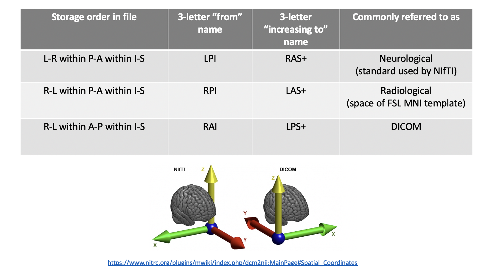

The purpose of this lab is to understand the basics of how images are stored and get hands-on practice interacting with images and the meta-data in their headers through the command line. 

**By the end of this practical you should be able to:**  
* [ ] understand the difference between image-voxel and scanner-world coordinates   
* [ ] recognize nifti files and access their header data with `fslinfo` and `fslhd`  
* [ ] use header data to describe anatomical image resolution: field of view, matrix size, slice thickness, voxel dimensions  
* [ ] use header data to identify image orientation   
 

**Access FastX** through the remote login:  
https://fastx.divms.uiowa.edu:3443/   
 

**Download our data for today**:  
*  Open the terminal
*  Change directories from your home directory to `fmriLab` with the command: `cd fmriLab`
*  To download data, copy/paste to the terminal `wget -O ds005.tar.gz https://www.dropbox.com/s/a3xsd5svookh6f9/ds005.tar.gz?dl=0`
*  Use commands introduced above to see what was downloaded
*  To unpack the download copy/paste `tar -xvf ds005.tar.gz`
*  Move yourself into the folder with data by typing `cd ds005`
 

 

**Introduction to two coordinate spaces for our MR images:**  
* Image-voxel space
  * Think of this as image storage space with voxels as our 3-dimenstional pixels that are our spatial unit of measurement for intensity values in the image. The coordinate origin of this space is (i,j,k)=0,0,0, positioned in the corner of the image as the initial index for storage of data in a matrix, where all values are positive and refer to the location of the mid-point of each whole voxel that will be given an image intensity value.
* Scanner-world space
  * Think of this as our destination space for our measurements of the brain, where we have mapped the image to the object as positioned in the physical world of the scanner using common scientific units of distance such as millimeters (mm). The coordinate origin of this space is (x,y,z)=0,0,0, positioned near the center of the image bounding box for subject-space and at a specific anatomical landmark near the center of the brain for standard-space (e.g., anterior commissure), so there will be both negative and positive values in this coordinate space.
 
 

**The table below summarizes common coordinate spaces in MRI/fMRI, with anatomical labels and common terms for referencing image orientation:**
    
 
 

**The figure below visualizes voxel and world space in the LPI/RAS+ orientation that NIfTI images are reconstructed to:**  
    
 

