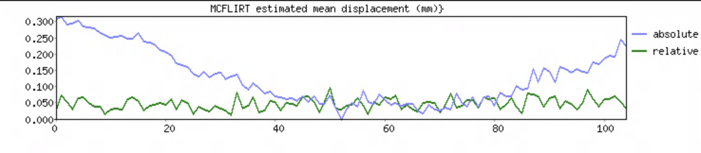
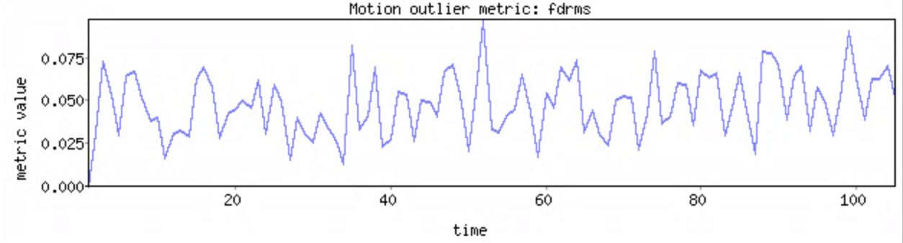
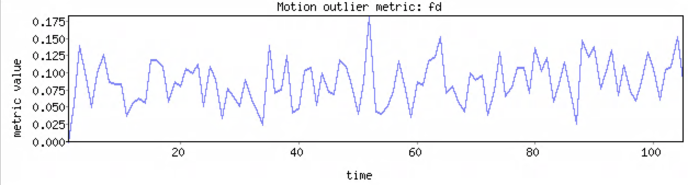
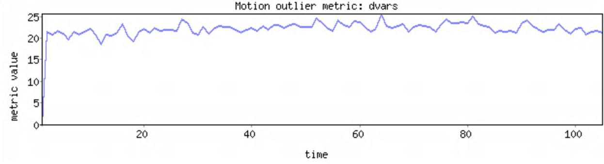

**Motion detection and correction**
</br>
The purpose of this lab is to practice correcting for volume-to-volume motion in a functional MR image, and to learn about common correction parameters and how to describe them with numbers and figures.

</br>


**By the end of this practical you should be able to:** <br/>
* [ ] use FSL's [mcflirt](https://fsl.fmrib.ox.ac.uk/fsl/fslwiki/MCFLIRT) tool to run motion correction 
* [ ] use FSL's [fsl_motion_outliers](https://fsl.fmrib.ox.ac.uk/fsl/fslwiki/FSLMotionOutliers) tool describe motion in funcitonal MRI data <br/>
* [ ] interpret the output of FSL's motion detection and correction tools 
* [ ] interpret the output of [mriqc](https://mriqc.readthedocs.io/en/stable/) for assessing motion


**Access FastX** through the remote login: <br>
https://fastx.divms.uiowa.edu:3443/  <br/>
<br/>


**Lab data** <br>
We will continue working with the data from `sub-01` in `ds003030` during class time.


**Step 1: Prepare a new derivatives directory for motion correction**
* At the terminal, type: `mkdir -p ~/fmriLab/ds003030/derivatives/func/sub-01/motion`
    * move yourself to this new directory with `cd`
    * copy our bold image here for ease to work with: `cp ~/fmriLab/ds003030/sub-01/func/sub-01_func_sub-01_task-FlickeringCheckerBoard_run-1_bold.nii.gz sub-01_task-bold.nii.gz`
 </br>

**Step 2: Run motion correction**

Using the code below, make a bash script called `run_mcflirt.sh` to run motion correction, and run it to produce motion correction output. <br>
* suggest to use VS Code editor
* to make a new file or edit an existing file: `code run_mcflirt.sh`
    * notice some new tricks for the code in the script:
        * define the input volume as a variable named `invol`
            * how can this be used later in the script?
            * why would we do this?
        * define the output of a command as a variable
            * find one example
        * expression of variables within `echo` commands
            * find one example
        * check if a file exists using an `if-then` statement


```
#!/bin/bash

invol="sub-01_task-bold"

echo "Determining middle volume in functional series"

halfPoint=$(fslhd "${invol}.nii.gz" | grep "^dim4" | awk '{print int($2/2)}')
echo "Middle volume is $halfPoint"


# check if .mat directory output exists and if so delete it
if [ -d ${invol}*.mat ]
	then 
		echo "cleaning up existing .mat file output" 
		rm -R ${invol}*.mat
	else
		echo "no existing .mat file detected (OK)"
fi
	

echo "Running MCFLIRT motion correction"

# Run mcflirt
mcflirt -in ${invol}.nii.gz \
-out ${invol}_proc-mcf \
-cost normcorr \
-refvol ${halfPoint} \
-plots \
-stats \
-rmsrel -rmsabs -spline_final


echo "Making plots of rotations, translations, and displacements"

# Plot rotations (radians)
fsl_tsplot -i ${invol}_proc-mcf.par \
-t 'MCFLIRT estimated rotations (radians)' \
-u 1 --start=1 --finish=3 -a x,y,z -w 640 -h 144 -o mot_rot.png

# Plot translations (mm)
fsl_tsplot -i ${invol}_proc-mcf.par \
-t 'MCFLIRT estimated translations (mm)' \
-u 1 --start=4 --finish=6 -a x,y,z -w 640 -h 144 -o mot_trans.png

# Plot volume displacement. Abs=relative to reference vol. Rel=relative to vol n-1.
fsl_tsplot -i ${invol}_proc-mcf_abs.rms,${invol}_proc-mcf_rel.rms \
-t 'MCFLIRT estimated mean displacement (mm)}' \
-u 1 -w 640 -h 144 -a absolute,relative -o mot_disp.png

echo "MCLFIRT script done and plots saved"


# Compute and plot frame-wise displacement as computed by Power et al., 2012
fsl_motion_outliers -i ${invol}.nii.gz \
-o ${invol}_mot_confounds-fd \
--fd -s ${invol}_mot_fd-ts.txt -p ${invol}_mot_fd-plot 
# use awk to compute mean of single column
fd_mean=$(awk '{ total += $1; count++ } END { print total/count }' ${invol}_mot_fd-ts.txt)


# Compute and plot frame-wise displacement as computed by Jenkinson et al., 2002
fsl_motion_outliers -i ${invol}.nii.gz \
-o ${invol}_mot_confounds-fdrms \
--fdrms -s ${invol}_mot_fdrms-ts.txt -p ${invol}_mot_fdrms-plot 
# use awk to compute mean of single column
fdrms_mean=$(awk '{ total += $1; count++ } END { print total/count }' ${invol}_mot_fdrms-ts.txt)


# Compute and plot frame-wise displacement as computed by Power et al., 2012
fsl_motion_outliers -i ${invol}.nii.gz \
-o ${invol}_mot_confounds-dvars \
--dvars -s ${invol}_mot_dvars-ts.txt -p ${invol}_mot_dvars-plot 
# use awk to compute mean of single column
dvars_mean=$(awk '{ total += $1; count++ } END { print total/count }' ${invol}_mot_dvars-ts.txt)


# Report motion descriptives to terminal
abs_mean=`cat sub-01_task-bold_proc-mcf_abs_mean.rms`
echo "Mean absolute head displacement was ${abs_mean}"

rel_mean=`cat sub-01_task-bold_proc-mcf_rel_mean.rms`
echo "Mean relative head displacement (Jenkinson et al., 2002) was ${rel_mean}"
echo "This should match mean fdrms (mm) as ${fdrms_mean}"

echo "Mean FD (Power et al., 2012) was ${fd_mean}"

echo "Mean DVARS (Power et al, 2012) was ${dvars_mean}"
```


**Step 3: View motion trace plots to interpret to assess severity of head motion**

A. **Interpretation of motion displacement estimates** </br>

**Jenkinson et al., 2002**
* Differentiating head realignment parameters across frames yields a six dimensional timeseries that represents instantaneous head motion. 
* Rotational displacements are converted from degrees to millimeters by calculating displacement on the surface of a sphere of radius 80 mm.
* Takes into account the range of voxel displacements over the sphere by computing the root-mean-square (with mean across all intracerebral voxels) of translation (mm) of the voxels before sphere model.
* This can be output from `mcflirt` with the `-rmsrel` flag, which matches the relative displacement (mm) trace shown together with the absolute displacement as estimated from our `mcflirt` call. This is the same variable referred to as `fdrms` computed by `fsl_motion_outliers`. Compare their traces below:<br>




**Power et al., 2012**
* Rotational displacements are converted from degrees to millimeters by calculating displacement on the surface of a sphere of radius 50 mm.
* Assumes that all voxels undergo equivalent displacements along the sphere in response to a given rotation.
* These tend to be about twice as large as the Jenkinson estimates, and we indeed replicate this trend as shown by the trace below: <br>

</br>

**TIP!** <br>
You can open a set of `.png` files from the terminal with a `loop` command like this: <br>
```
for p in mot_*.png; do eog "$p";done
```
</br>
B. **Interpretation of FSL-derived volume-to-volume bold intensity estimates** </br>
* `DVARS` is the root-mean-square intensity difference of volume N to volume N+1 as proposed by Power et al., 2012. This quantifies the rate of volume-to-volume change in the BOLD signal. Higher values indicate more instances of rapid changes in BOLD signal intensity, which is an indicator of more volumes corrupted by motion. So higher is bad.
* Think of this as an intensity-based metric that matches the FD volume-displacement based metric shown above. For higher motion subjects when the quality of motion correction is highly variable, then an intensity based estimate could be more reliable.



C. **Interpretation of MRIQC-derived image quality metrics relevant to motion** </br>
* [MRIQC](https://mriqc.readthedocs.io/en/stable/) is a tool developed by the Poldrack Lab at Stanford University for use at the Center for Reproducible Neuroscience (CRN), as well as for open-source software distribution. We will not run this tool on our data today, but it's a great tool for generating nice summary reports of your data for inspection.
* Download the MRIQC report for sub-01's functional data [here](https://www.dropbox.com/s/wtydb4oclinklak/sub-01_MRIQC_%20individual%20bold%20report.pdf?dl=0)


**Lab Homework** 

* Download another subject with their mriqc plot
    * interpret carpet plot and motion profile
* Describe the difference between a volume displacement metric and a signal intensity metric
    * Use a metaphor to describe how each captures distinct aspects of motion in the data
* Look at five papers in your field and evaluate the following questions about how they delt with motion:
    * Was any data discarded due to motion, and if so, based on what criteria?
    * Was the tool used for motion correction specified?


