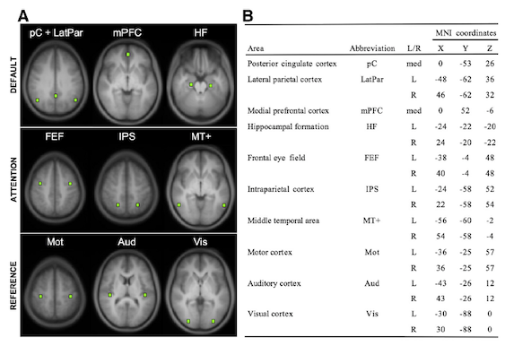

**Resting State Functional Connectivity**
 
The purpose of this lab is to walk through key steps of data processing for resting state functional connectivity analyses. The lab is built to emphasize understanding several key steps rather than a how-to of running one of many possible software packages that run these steps start to finish.

 

**By the end of this practical you should be able to:**  
* [ ] understand the basic preprocessing steps to prepare data for functional connectivity analyses
* [ ] understand what a nuisance regression is  
* [ ] understand the difference between a functional connectivity map and a functional connectivity matrix 

**Access FastX** through the remote login:  
https://fastx.divms.uiowa.edu:3443/   
 

**Lab data**  
We will download new data that includes resting state BOLD data from one participant:
* cd to fmriLab: `cd fmriLab`
* download data: `wget -O restingState.tar.gz https://www.dropbox.com/s/pc8outqs66hf5m7/restingState.tar.gz?dl=0 `
* unpack: `tar -xvf restingState.tar.gz`
* clean-up: `rm restingState.tar.gz`

 
 

**Step 0: Source AFNI**
* [AFNI](https://afni.nimh.nih.gov/) is another image processing software that has handy command line functions
* see instructions [here](https://github.com/mwvoss/MRI-lab-classes/wiki/Setup-FSL-and-AFNI-in-remote-linux-environment) for setting up access to AFNI on the fastX nodes for general use

 
 

**Step 1 (pre-baked): Prepare functional data with preprocessing**
* This has been completed for sake of time, but derivatives of the process are avaiable in case you'd like to replicate
* Move yourself to the derivatives directory where we'll put processed data: 
    * `cd /fmriLab/restingState/derivatives/rsOut`
* Copy our bold image here for ease to work with and it's clearly labeled as our starting raw image: 
    * `cp ~/fmriLab/restingState/sub-001/func/sub-001_task-rest_bold.nii.gz sub-001_func-raw.nii.gz`
* Preprocessing:
    * setup preprocessing only using the FEAT GUI, including creation of registration transforms 
        * `Data` tab
            * select `Preprocessing` next to the `First-level analysis` option
            * select your `sub-001_func-raw.nii.gz` image as your 4D data
            * name the output directory as a folder called `preproc_affine` within `rsOut`
            * delete the first 4 volumes, which are dummy volumes that were saved in these data
        * `Pre-Stats` tab
            * adjust smoothing to 6mm
            * turn OFF Highpass filtering
        * `Registration` tab
            * specify skull-stripped anatomical as your high-resolution input
            * specify both transforms as affine 12 DOF
                * note the result of bbr+non-linear is in the `preproc` directory for comparison
        * Hit `Go`
    * our preprocessed data is `preproc.feat/filtered_func_data.nii.gz`
* Use registration transforms to warp our preprocessed data into MNI space
    * Skills and tools from this [lab](https://github.com/mwvoss/MRI-lab-classes/blob/master/PSY6280-2020-FA2020/practical_spatial-registration.md)
    * `flirt -in preproc_affine.feat/filtered_func_data.nii.gz -ref ${FSLDIR}/data/standard/MNI152_T1_2mm_brain.nii.gz -out sub-001_func-reg.nii.gz -applyxfm -init preproc_affine.feat/reg/example_func2standard.mat`
* We now have a functional nifti image that has been preprocessed in the spatial dimension and only needs further filtering in the temporal dimension
* You also have an `ROIs` directory which contains left and right motor and visual ROIs from the [Van Dijk et al](https://github.com/mwvoss/MRI-lab-classes/blob/master/PSY6280-2020-FA2020/pdfs/Van%20Dijk-2010-Intrinsic%20functional%20connectivit.pdf) paper as shown in the table below. These ROIs were made with the `makeROI.sh` bash script that you can try out for making your own ROIs of a given size and shape (sphere or cube) from MNI coordinates, which is the default reference space.  

 
 
 

**Step 2: Nuisance regression**
* we'll start here during class
    * first let us: open our prepared functional data and ROIs for visual inspection and review our goals with nuisance regression
    * move yourself to where the data are for easier loading in fsleyes: `cd /fmriLab/restingState/derivatives/rsOut`
    * open our prepped functional image: `sub-001_func-reg.nii.gz`
* extract timeseries data for nuisance regression
    * use `fslmeants` to make timeseries plots for Nuisance ROIs, from `rsOut` directory:
        * example for global: `fslmeants -i sub-001_func-reg.nii.gz -o nuisanceRegression/global_ts.txt -m ../ROIs/global.nii.gz`
    * use `fsl_tsplot` to plot them together for comparison
        * from nuisanceRegression directory: `fsl_tsplot -i global_ts.txt,latvent_ts.txt,wmroi_ts.txt -a global,csf,wm -o nuisanceROIs`
    * use `paste` to stitch together columns of nuisance BOLD and 6 motion parameter regressors, from nuisanceRegression directory: `paste ../preproc_affine.feat/mc/prefiltered_func_data_mcf.par global_ts.txt wmroi_ts.txt latvent_ts.txt >> nuisance_ts.txt`
* run nuisnace regression
    * use AFNI's `3dTproject` to run nuisance regression with nuisance BOLD and motion regressors enterered simultaneously with bandpass regressors: `3dTproject -input sub-001_func-reg.nii.gz -prefix sub-001_func-reg-bp-resid.nii.gz -mask ../ROIs/mask_mni.nii.gz -bandpass .008 .08 -ort nuisanceRegression/nuisance_ts.txt -verb`
        * see what changed by compare timeseries data before and after nuisance regression: `fsleyes sub-001_func-reg.nii.gz sub-001_func-reg-bp-resid.nii.gz`

 
 

**Step 3: Seed-to-brain correlation maps**
* extract residual (preprocessed) timeseries from the left motor cortex ROI, from the `rsOut` directory: `fslmeants -i sub-001_func-reg-bp-resid.nii.gz -o seedFC/lmot_resid_ts.txt -m ../ROIs/lmot.nii.gz`
* use [AFNI's `3dTcorr1D` tool](https://afni.nimh.nih.gov/pub/dist/doc/program_help/3dTcorr1D.html) to make a seedmap: 
    * from `rsOut`: `3dTcorr1D -prefix seedFC/lmot_corrmap.nii.gz -pearson sub-001_func-reg-bp-resid.nii.gz seedFC/lmot_resid_ts.txt`
    * view with `fsleyes`
        * these are pearson r correlations: view histogram, what is range?
            * note when doing group analyses, it's often helpful to transform your pearson r's to Fisher's r
            * this is an option in the `3dTcorr1D` function
        * threshold the correlation map, is the seed correlated most strongly with itself?
        * what other regions have a timeseries correlated with the seed?
    * replicate steps with the left visual ROI; below is view of my result for the left visual cortex seed, thresholded at r >.50
    

 
 

**Step 4: ROI-to-ROI correlation matrix**
* use the steps shown above to make residual timeseries files for the left and right motor cortex ROIs, left and right visual cortex ROIs, and the global mask ROI, and place them all in the `seedFC` directory
* change directories to where your residual timeseries data are: `cd seedFC`
* use `paste` to make a text tile with all the timeseries data entered as columns: 
    * `paste global_resid_ts.txt lmot_resid_ts.txt rmot_resid_ts.txt lvis_resid_ts.txt rvis_resid_ts.txt >> rois_resid_ts.txt`
* use supplied `plot_roicorr.R` script to compute correlation matrix and plot as a heat-map
    * at terminal: `Rscript plot_roicorr.R`
    * the result should a `.png` file named `roicorr_heatmap.png` that looks like below:

 
 

**Discussion questions:**
* is it surprising that the correlation of each ROI of interest is 0 with the global signal?
* compare the within-system functional connectivity (fc) of the motor and visual systems
* how does within and between system fc compare with expectations? which are more affected by the global signal used in nuisance regression?
* how would we do group analyses with the seed-maps and ROI-to-ROI correlations?

