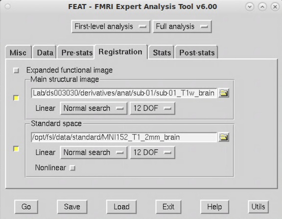

**By the end of this practical you should be able to:**  
* [ ] specify preprocessing for task-related BOLD signal in the FEAT GUI  
* [ ] create and understand a model of task-related BOLD signal in the FEAT GUI  
* [ ] understand how to test for activation differences between conditions  
* [ ] locate and view the activation maps in fsleyes  
 

**Access FastX** through the remote login:  
https://fastx.divms.uiowa.edu:3443/   
 

* Move to the root directory for our ds003030 dataset: `cd ~/fmriLab/ds003030/` 
    * In the terminal, type `fsl` to bring up the GUI
    * click on `FEAT FMRI analysis`
    
* Data tab
    * Click `Select 4D data` and select the full path to our initial functional image `~fmriLab/ds003030/sub-01/func/sub-01_func_sub-01_task-FlickeringCheckerBoard_run-1_bold`
    * Set the `Output directory` to a sub-directory of the `derivtives/func` directory with the folder name of `feat`, such as `~/fmriLab/ds003030/derivatives/func/sub-01/feat`
    * A `Highpass` temporal filter will let high frequency signals pass through and filter out frequencies lower than the filter setting. The setting here specifies the duration in seconds for one full cycle of a condition to occur, and frequencies `any lower` will be removed.
        * For this data we can set the `High pass filter cutoff(s)` to as low as `40s`
        * This is the time it takes for a full cycle of one condition to occur (checker(20s)-music(20s)-checker(20s)-etc..)
    * Example of completed setup: 
    

* Pre-stats
    * Keep `MCFLIRT` on for motion correction
    * Keep slice timing set as `None`
    * Keep `BET brain extraction` on with selection box shown as yellow
    * Keep spatial smoothing set at `5 mm` FWHM
    * Keep intensity normalization as `off`
    * Keep `Highpass` set as on
    * Keep `MELODIC ICA` set as off
    * Example of completed setup:  
    

* Registration tab
    * Select `Main structural image` and select our skull-stripped T1 image as input
    * Keep the `MNI152_T1_2mm_brain` image as our standard space reference
    * For purposes of speed to prioritize focus on setting up the first-level model and viewing results
        * Change the registration of the `Main image` to `12 DOF`
        * Keep `Nonlinear` registration turned off
    * Example of completed setup:  
    

* Stats tab
    * Keep `FILM prewhitening` on
    * Change `Don't Add Motion Parameters` to `Standard Motion Parameters` to add motion paramers to our model
    * Keep `Add additional confound EVs` off
    * Click `Full Model setup`
        * Specify `EV1` as the checkerboard stimulus
            * Change `Basic Shape` from `Square` to `Custom (3 column format)`
            * Select task timing file for the checkerboard stimulus created above
            * Set `Convolution` to `Gamma` and leave the HRF parameter settings
            * Keep `temporal derivative` on and applied
            * Example:  
            
        * Specify `EV2` as the music stimulus
            * Replicate settings for EV1
            * Use task timing file for music stimulus
        * Contrasts & F-tests tab
            * For this design, we can only contrast relative activation for each condition
            * These contrasts would be set as shown below:  
            
        

* Post-stats tab
    * Keep all default settings on
    * Statistical thresholding is more important for group-level analysis for shorter scans

* Click Go. When it's finished, the results will appear within your feat directory. 
    * Your html report will then include output of brain activation maps as previewed below. We will walk through the contents of the report in class.  
    

* Using `fsleyes` will allow us to view the results more interactively:
    * Use the html report to locate the directory where the activation maps are on your computer
    * Use the terminal to move yourself there: `cd ~/fmriLab/ds003030/derivatives/func/sub-01/feat.feat`
    * Open fsleyes through the terminal with settings for viewing FEAT output: `fsleyes -s feat filtered_func_data.nii.gz thresh_zstat1`
    * You should see a display like below in `fsleyes`. Clicking on the buttons with arrows in the column labeled `Z Max location` will move your cursor to the location of that peak in brain activation. With this interactive table open, you can also view your activation maps using the `Lightbox` view we previewed when learning about `fsleyes`. Give it a try!
    * For a full description of plotting the model and data timeseries, see the [fsleyes documentation on viewing FEAT output](https://users.fmrib.ox.ac.uk/~paulmc/fsleyes/userdoc/latest/feat_mode.html)
 

* Before next class, repeat the same steps on `sub-02` and `sub-03`
    * First, you will need to run skull-stripping with `bet`
        * Follow steps in this [lab](https://github.com/mwvoss/MRI-lab-classes/blob/master/PSY6280-2020-FA2020/practical_structural-image-bet-and-qc.md) to create `anat` derivatives with their corresponding `sub-*_T1w_brain.nii.gz` images

