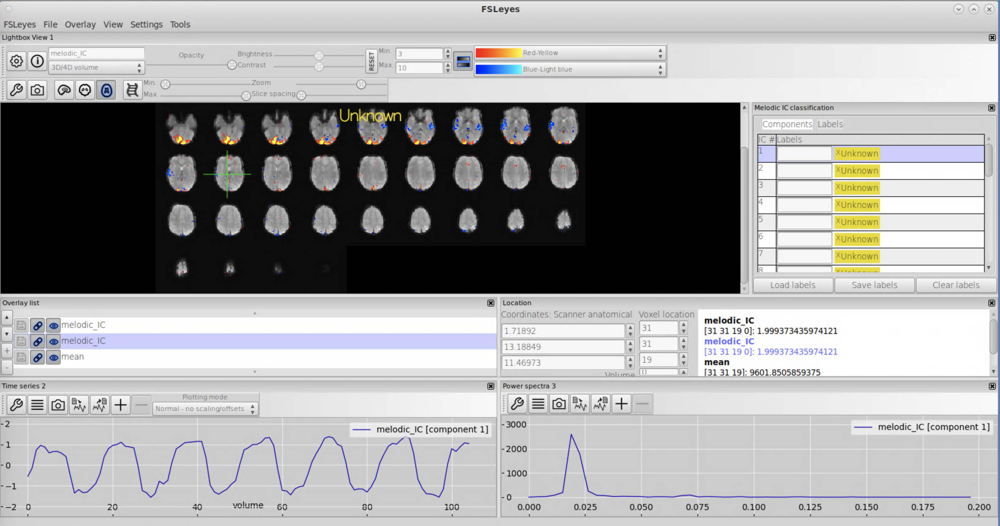
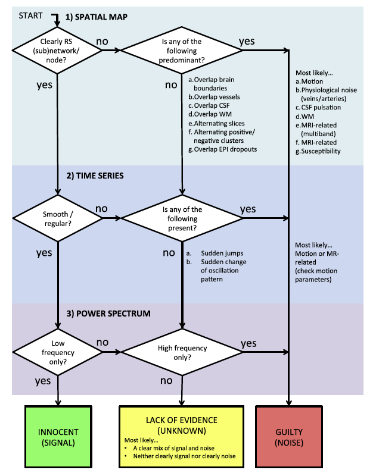

**Spatiotemporal denoising with independent component analysis**
 
The purpose of this lab is to get hands-on experience interpreting the output of spatial independent component analysis as run in FSL's MELODIC program, with emphasis on labeling components to denoise fMRI data. The experience of manual labeling will help help you become familiar with the various sources of noise in fMRI data even after standard preprocessing, and will help you appreciate when and how to apply ICA approaches that are a blend of manual and automatic component classification (e.g., FSL's FIX) or fully automated with tuning to specific types of noise (e.g., ICA-AROMA for motion). 

 

**By the end of this practical you should be able to:**  
* [ ] interpret the output of FSL's [MELODIC](https://fsl.fmrib.ox.ac.uk/fsl/fslwiki/MCFLIRT) tool for a single-subject ICA analysis
* [ ] open MELODIC-estimated components within fsleyes's melodic scene viewer
* [ ] understand the process of manually labeling components as signal or noise using a conservative "innocent until proven guilty" criteria such as outlined in [Griffanti et al., 2017](https://github.com/mwvoss/MRI-lab-classes/tree/master/PSY6280-2020-FA2020/pdfs/Griffanti-2017-ICA.pdf)
* [ ] understand the implications of spatial smoothing when applying single-subject ICA for denoising
 

**Access FastX** through the remote login:  
https://fastx.divms.uiowa.edu:3443/   
 

**Lab data**  
We will continue working with the data from `sub-01` in `ds003030` during class time. Because melodic is a blind source separation process, the order of the componentns can be slightly different each time it is run on the same dataset. For our group work it will be easier to all have the same output, so you'll download melodic output and we'll focus on interpretation.

**Step 1: Prepare a new derivatives directory for melodic output**
* At the terminal, move yourself to the `func` derivatives directory: `cd ~/fmriLab/ds003030/derivatives/func/sub-01/`
    * Download melodic derivatives folder: `wget -O melodic.tar.gz https://www.dropbox.com/s/1r3iw2wyswlr8ls/melodic.tar.gz?dl=0`
    * Unpack: `tar -xvf melodic.tar.gz`
    * Remove uneeded tar zip: `rm melodic.tar.gz`
    * You now have melodic deriviatives for `sub-01`, which includes output of single-subject ICA on their flickering checkerboard bold data both with (`melodic.ica`) and without spatial smoothing (`melodic_no-smooth.ica`).
  

**Step 2: Open the melodic web report for overview of results** 
* Within the file browser, navigate to the `melodic.ica` directory and open the `report.html` file with a web browser
* **Break-out questions**
    * `Pre-Stats` page: is relative motion more similar to the FD Jenkinson or FD Power metric?
    * `Registration` page: look through overlays to evaluate alignment of functional data to MNI. Any concerns?
    * `Log` page: here's where everything that was run is documented, starting with `Initialisation` you can see the initial input was the raw nifti bold image without preprocessing. What file is the input to melodic processing?
    * Finally, the main results are shown in the `ICA` page: take a look with your group and discuss questions from your exploration. We will come back and review understanding as a group.
 

 **Step 3: Open melodic-derived components in fsleyes** 
* Now let's see how to view the component output interactively in fsleyes to support manual labeling of components as signal or noise
* In the terminal, move yourself to the `melodic.ica` directory: `cd ~/fmriLab/ds003030/derivatives/func/sub-01/melodic/melodic.ica`
* Open fsleyes with the melodic scene setting: `fsleyes --scene melodic -ad filtered_func_data.ica filtered_func_data.ica/melodic_IC.nii.gz`
* You should see something like below:  

* **Break-out questions to prep for manual labeling**
    * This data was acquired during a task that cycled between task conditions of flickering checkerboard and music every 20 seconds. This corresponds to an expected period of 40 seconds for one condition to traverse a full cycle. The frequency for a waveform is equal to `1/period`. Use this information to determine the expected frequency for components that correspond to activation for one or the other task conditions. How does this align with the power spectrum for the first component?
    * The `Nyquist frequency` is half the sampling rate. The Nyquist frequency is also called the Nyquist limit or folding limit, because it is the highest frequency that can be faithfully recovered at a given sampling rate in order to be able to fully reconstruct the signal. When a source signal is faster than this limit, then it may get aliased or "folded" into the reconstructed signals as a slower frequency signal.
        * The sampling rate for fMRI data is the Time of Repetition (TR), which is the rate of measurement for each 3D bold image in our 4D series. Reminder the `TR` for this data is 2.5 seconds.
        * Convert this period to frequency as `1/TR = 1/2.5 = .4 Hz`
        * Our Nyquist limit is then half the sampling frequency: `.4/2 = .2 Hz`
        * This means the highest frequency signal that could be truly recovered in this bold data is less than or equal to .2 Hz.
        * Compare this limit to the power spectrum shown for each component in fsleyes. 
            * What does this mean for physiological noise that would occur at higher frequencies? How might the timeseries look for components with these sources?
    * To label a component, double click within the open text box next to the component in the `Melodic IC classification` viewer.
        * For denoising purposes, only the distinction of signal vs. noise is used
        * Additional details about the source of noise could be useful if you would like to track the number of components from different sources in your data, and you could use that information for testing selective denoising tuned to one type of noise source.
 

 **Step 3: Label components in fsleyes** 
* Work with your **break-out group** to label each component minimally as signal or noise, and within the melodic classification GUI select a more specific noise label as you're comfortable
* Each group will get a link to a google sheet where you can list your classification of signal vs. noise   
    * please make an entry as you progress through the components, Michelle will use progress on the sheets to see when we're ready to come back together 
* When we come back together we'll compare ratings and discuss "score-driving" features 
* Resources: 
    * Use the decision tree shown in Griffanti et al to step through each component in space, time, and frequency: 
    
    * If you are less familiar with activation patterns considered "signal" based on the literature, use the spatial maps shown in the [Smith et al., paper](https://github.com/mwvoss/MRI-lab-classes/blob/master/PSY6280-2020-FA2020/pdfs/Smith-2009-BrainNets.pdf) as a complementary resource.  

